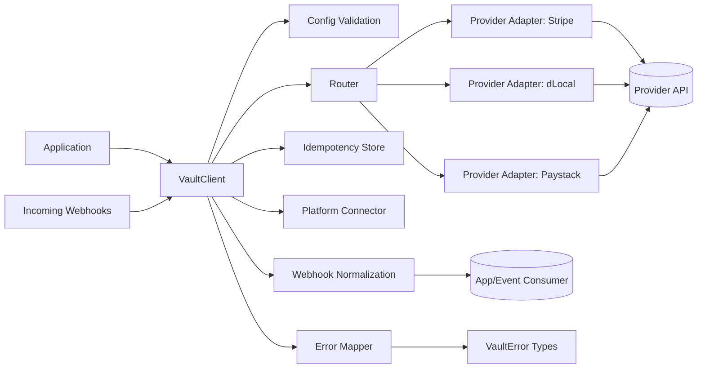

VaultSaaS SDK normalizes provider adapters behind a single orchestration client, providing a unified interface for payment processing across multiple payment providers.

## Architecture Diagram



## Core Components

### VaultClient

The main orchestration client that serves as the entry point for all operations:

- **Charge**: Process one-time payments
- **Authorize**: Pre-authorize payments for later capture
- **Capture**: Capture previously authorized payments
- **Refund**: Process refunds for completed payments
- **Void**: Cancel authorized payments
- **Status**: Check transaction status
- **Webhooks**: Handle and normalize provider webhook events

<Info>
The VaultClient is located at `src/client/vault-client.ts:65` and manages all provider adapters, routing logic, and platform integration.
</Info>

### Router

Evaluates routing rules and provider capabilities to determine which payment provider should handle each transaction.

<CodeGroup>
```typescript Router Implementation
import { Router } from '@vaultsaas/core';

const router = new Router(
  [
    {
      provider: 'stripe',
      match: {
        currency: 'USD',
        paymentMethod: 'card',
      },
    },
    {
      provider: 'dlocal',
      match: { default: true },
    },
  ],
  {
    adapterMetadata: metadataRecord,
    logger: customLogger,
  }
);
```

```typescript Routing Decision
const decision = router.decide({
  currency: 'USD',
  country: 'US',
  paymentMethod: 'card',
  amount: 2500,
});

console.log(decision.provider); // "stripe"
console.log(decision.reason); // "rule matched at index 0 using currency, paymentMethod"
```
</CodeGroup>

<Note>
The Router must include at least one rule with `match.default: true` to serve as a fallback.
</Note>

### Provider Adapters

Implement provider-specific API calls and webhook verification. Each adapter:

- Translates normalized requests into provider-specific API calls
- Normalizes provider responses into canonical formats
- Handles webhook signature verification
- Declares supported payment methods, currencies, and countries

<CodeGroup>
```typescript Stripe Adapter
import { StripeAdapter } from '@vaultsaas/core';

const adapter = new StripeAdapter({
  apiKey: process.env.STRIPE_API_KEY,
  webhookSecret: process.env.STRIPE_WEBHOOK_SECRET,
});
```

```typescript dLocal Adapter
import { DLocalAdapter } from '@vaultsaas/core';

const adapter = new DLocalAdapter({
  xLogin: process.env.DLOCAL_X_LOGIN,
  xTransKey: process.env.DLOCAL_X_TRANS_KEY,
  secretKey: process.env.DLOCAL_SECRET_KEY,
});
```

```typescript Paystack Adapter
import { PaystackAdapter } from '@vaultsaas/core';

const adapter = new PaystackAdapter({
  secretKey: process.env.PAYSTACK_SECRET_KEY,
  webhookSecret: process.env.PAYSTACK_WEBHOOK_SECRET,
});
```
</CodeGroup>

### Error Mapper

Normalizes provider-specific and network failures into canonical `VaultError` codes with consistent error shapes.

```typescript Error Mapping
import { mapProviderError } from '@vaultsaas/core';

try {
  await adapter.charge(request);
} catch (error) {
  throw mapProviderError(error, {
    provider: 'stripe',
    operation: 'charge',
  });
}
```

<Tip>
All errors include `code`, `category`, `suggestion`, `docsUrl`, `retriable`, and `context` fields for comprehensive error handling.
</Tip>

### Idempotency Store

Prevents duplicate operation execution for repeated idempotency keys.

```typescript Idempotency Configuration
import { MemoryIdempotencyStore } from '@vaultsaas/core';

const vault = new VaultClient({
  // ... provider config
  idempotency: {
    store: new MemoryIdempotencyStore(),
    ttlMs: 24 * 60 * 60 * 1000, // 24 hours
  },
});
```

<Warning>
The default `MemoryIdempotencyStore` is not suitable for production multi-instance deployments. Implement a distributed store using Redis or your database.
</Warning>

### Platform Connector

Optional component for telemetry and remote routing integration with VaultSaaS platform.

```typescript Platform Integration
const vault = new VaultClient({
  providers: { /* ... */ },
  routing: { /* ... */ },
  platformApiKey: process.env.VAULTSAAS_API_KEY,
  platform: {
    baseUrl: 'https://api.vaultsaas.com',
    timeoutMs: 5000,
    batchSize: 100,
    flushIntervalMs: 10000,
  },
});
```

<Info>
When enabled, the Platform Connector sends transaction reports and webhook events for analytics, and can provide dynamic routing decisions.
</Info>

## Data Flow

### Payment Processing Flow

1. Application calls `vault.charge(request)`
2. VaultClient validates configuration
3. Router evaluates rules and selects provider
4. Idempotency check (if `idempotencyKey` provided)
5. Provider adapter executes API call
6. Error mapper handles failures
7. Response normalized and returned
8. Transaction report queued to Platform Connector

### Webhook Processing Flow

1. Provider sends webhook to application endpoint
2. Application calls `vault.handleWebhook(provider, payload, headers)`
3. Adapter verifies signature (if supported)
4. Event normalized to `VaultEvent` format
5. Event returned to application
6. Event queued to Platform Connector

## Configuration Validation

The VaultClient validates configuration at initialization:

```typescript src/client/vault-client.ts:76
validateVaultConfig(config);
```

<Note>
Configuration validation ensures:
- At least one enabled provider exists
- All adapters are properly configured
- Routing rules include a default fallback
- Required credentials are present
</Note>

## Next Steps

<CardGroup cols={2}>
  <Card title="Routing" icon="route" href="/concepts/routing">
    Learn how to configure routing rules
  </Card>
  <Card title="Error Handling" icon="exclamation-triangle" href="/concepts/error-handling">
    Understand error types and handling
  </Card>
  <Card title="Idempotency" icon="repeat" href="/concepts/idempotency">
    Implement safe retry logic
  </Card>
  <Card title="Webhooks" icon="webhook" href="/concepts/webhooks">
    Handle provider webhooks
  </Card>
</CardGroup>